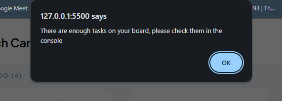

# JSL03 Project Brief: Console-Based Task Manager

---

## Overview

This project involves creating a **simple task management system** where users can add **up to three new tasks** to an existing task array. Tasks are **stored as objects in an array**, each with a **unique incremental ID**. Users will enter task details via prompts, and the system will allow filtering to view only completed tasks. The project focuses on **array manipulation, user interaction via prompts and alerts, and console logging for task management**.

## ✨ Features

### Logic & User Interaction

- Tasks stored as **objects inside an array** for structured code.
- Prompt users to enter their three Task **(task details(title, description,status)** each task has **unique incremental ID**)
- Prompt users to enter **task details (title, description, status)** and store them in an object.
- 
- **Case-Insensitive Handling** - Status entries like "Todo", "DONE", or "Doing" are all accepted and converted to lowercase for consistency.
- **Console Output** If there are completed tasks (status: "done"), their title and status are displayed in the console.

## Code Quality & Maintainability

- Use meaningful variable and function names to ensure readability and maintainability.
- **Clean, Maintainable Code** - HTML, CSS, and JavaScript are separated into dedicated files, following best practices for readability and maintainability.

---
### Technologies

- **HTML5** – Semantic structure and layout.
- **CSS3** – Styling, colours, and responsive design.
- **JavaScript (ES6)** – Dynamic functionality, prompts, validation, and console output.

---

## 🚀 Setup Instructions

1. **Clone the repository** git clone [repository-url]
2. **Open the project folder** Navigate to the directory where the files are stored
3. **Run locally** Open index.html in your preferred browser (Chrome, Firefox, etc.). The task input prompts will appear automatically.

## Expected Outcome

A **structured and limited task management system** that enables users to add, review, and filter tasks efficiently while ensuring **clean, well-documented, and maintainable code.**

**Alert message of the maximum task required:**

**Console Log of all and completed tasks:**

